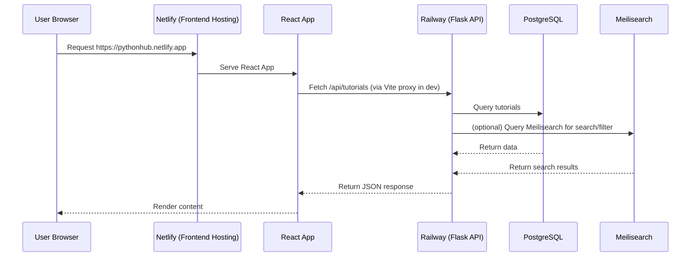

# PYTHON_HUB_DEEP_DIVE.md

---

## 1. Project Vision & Guiding Principles

**Mission:**
> To create a high-quality, accessible Python learning platform that empowers users of all backgrounds to master Python through interactive content and a vibrant community.

**Guiding Principles (In-Depth):**
- **Accessibility First (WCAG 2.1 AA):**
  - *What this means in practice:*
    - **Keyboard Navigation:** All interactive elements (buttons, links, forms) are accessible via keyboard (Tab, Enter, Space, etc.).
    - **Semantic HTML:** Use of correct HTML5 elements (`<nav>`, `<main>`, `<header>`, `<footer>`, `<section>`, etc.) for structure and screen reader compatibility.
    - **ARIA Roles:** Use of ARIA attributes (e.g., `role="button"`, `aria-label`) to enhance accessibility for assistive technologies.
    - **Color Contrast:** All text and UI elements meet or exceed WCAG 2.1 AA color contrast ratios for readability.
- **Security by Design:**
  - *How this is implemented:*
    - **Input Validation:** All incoming data is validated using Marshmallow schemas in Flask, preventing malformed or malicious input.
    - **ORM-Only Queries:** All database access is through SQLAlchemy ORM, preventing SQL injection.
    - **JWT Authentication:** All protected endpoints require JWTs, with access and refresh tokens, and secure password hashing (bcrypt).
    - **Rate Limiting:** Flask-Limiter is used to prevent brute-force and abuse.
    - **Security Headers:** Flask-Talisman sets HTTP headers (CSP, HSTS, etc.) to mitigate XSS, clickjacking, and other attacks.
- **Phased, MVP-First Rollout:**
  - *Strategy:*
    - **Phase 1:** Launch with a polished, reliable core (content management, search, authentication) to build user trust and gather feedback.
    - **Phase 2:** Add community features (comments, votes, code playground) once the core is stable and user base is growing.
    - **Phase 3:** Expand to advanced features (multi-language support, gamification, analytics) based on real user needs.

---

## 2. Architectural Deep Dive

### **Backend Architecture (Flask)**
- **Why Flask + Factory Pattern?**
  - *Flexibility:* Easily swap or configure extensions (DB, cache, etc.) per environment.
  - *Explicit Setup:* All dependencies are initialized in `app/__init__.py`, making the app easy to test and reason about.
  - *Testability:* Factory pattern allows for isolated app instances in tests.
- **Key Libraries:**
  - **SQLAlchemy:** ORM for safe, efficient DB access.
  - **Meilisearch:** Decouples search from DB, enabling fast, typo-tolerant, faceted search.
  - **Celery/Redis:** Handles background jobs (e.g., email, indexing) without blocking API requests.

### **Frontend Architecture (React + TypeScript)**
- **Why React + TypeScript?**
  - *Type Safety:* Prevents many runtime bugs, enables better IDE support and refactoring.
  - *Scalability:* TypeScript is essential for large, multi-contributor projects.
- **State Management Choices:**
  - **TanStack Query:** Handles server state (API data), caching, background refetching, and reduces unnecessary API calls.
  - **Zustand:** Minimal, scalable solution for client-only state (auth token, theme, UI state) without boilerplate.

### **Data & Request Flow Diagram**



---

## 3. Folder Structure Explained

### **Backend**
```
backend/
├── app/
│   ├── __init__.py         # App factory, extension setup, blueprint registration
│   ├── api/                # All API route blueprints (REST endpoints)
│   ├── models/             # SQLAlchemy models (User, Tutorial, etc.)
│   ├── schemas/            # Marshmallow schemas for validation/serialization
│   ├── services/           # Integrations (Meilisearch, email, etc.)
│   ├── auth/               # Auth logic (JWT, RBAC, social login stubs)
│   ├── tests/              # Pytest-based tests
│   ├── extensions.py       # Extension instances (db, jwt, limiter, etc.)
│   ├── error_handlers.py   # Centralized error handling
│   ├── log_config.py       # Logging setup (JSON, rotating, etc.)
│   └── swagger.py          # Swagger/OpenAPI setup
├── config.py               # Environment-based config classes
├── requirements.txt        # Python dependencies
├── wsgi.py                 # WSGI entrypoint
├── Dockerfile              # Backend Docker build
├── README_ENV.md           # .env variable documentation
├── migrations/             # Alembic/Flask-Migrate DB migrations
└── railway.json            # Railway deployment config
```
- **Factory Pattern:** `app/__init__.py` creates the Flask app, initializes extensions, and registers blueprints for modularity and testability.

### **Frontend**
```
frontend/
├── src/
│   ├── components/   # Reusable UI components (Header, SearchBar, etc.)
│   ├── pages/        # Route-level pages (HomePage, TutorialListPage, etc.)
│   ├── hooks/        # Custom React hooks (API, state, forms)
│   ├── services/     # API clients (e.g., apiClient.ts)
│   └── styles/       # Tailwind/global styles
│   ├── App.tsx       # Main app layout, routing
│   └── main.tsx      # React entrypoint (renders <App />)
├── package.json      # Frontend dependencies
├── vite.config.ts    # Vite config (dev server, proxy)
├── tsconfig.json     # TypeScript config
├── tailwind.config.js# Tailwind CSS config
├── netlify.toml      # Netlify deployment config
└── index.html        # HTML entrypoint
```
- **App.tsx:** Sets up React Router and main layout.
- **main.tsx:** Bootstraps the React app.

---

## 4. Getting Started (Comprehensive Local Setup Guide)

1. **Prerequisites:**
   - Docker & Docker Compose
   - Node.js (v18+)
   - Python (v3.10+)
2. **Environment Setup:**
   - Clone the repository.
   - In `backend/`, copy `README_ENV.md` to `.env` and fill in values. Example:
     ```env
     FLASK_ENV=development
     DATABASE_URL=postgresql://postgres:postgres@db:5432/postgres
     SECRET_KEY=your-secret-key
     MEILI_URL=http://meilisearch:7700
     MEILI_API_KEY=masterKey
     REDIS_URL=redis://redis:6379/0
     JWT_SECRET_KEY=your-jwt-secret
     ```
3. **Launch Services:**
   - From the project root, run:
     ```sh
     docker-compose up --build
     ```
   - **Services:**
     - `backend`: Flask API
     - `db`: PostgreSQL database
     - `redis`: Redis for Celery tasks
     - `meilisearch`: Search engine
4. **Run Frontend:**
   - In a new terminal, navigate to `frontend/` and run:
     ```sh
     npm install
     npm run dev
     ```
5. **Access Points:**
   - **Frontend:** http://localhost:5173
   - **Backend API:** http://localhost:5000
   - **API Docs:** http://localhost:5000/apidocs
   - **Meilisearch Dashboard:** http://localhost:7700 (default admin key: `masterKey`)
6. **Database Migration:**
   - To apply the latest DB schema, run:
     ```sh
     docker-compose exec backend flask db upgrade
     ```
   - This ensures your DB is up to date with the latest models.
7. **Troubleshooting:**
   - **DB Hostname Issue:** If you see connection errors, ensure `DATABASE_URL` uses `db` as the hostname (Docker Compose service name).
   - **.env Not Loaded:** Make sure `.env` is present in `backend/` and all required keys are set.
   - **Port Conflicts:** Ensure ports 5000 (backend), 5173 (frontend), and 7700 (Meilisearch) are free.

---

## 5. Security Framework Deep Dive

- **Authentication:**
  - JWT-based: Users receive access and refresh tokens on login. Access tokens are used for most API calls; refresh tokens are used to obtain new access tokens securely.
- **Authorization:**
  - Role-Based Access Control (RBAC) decorators restrict sensitive endpoints to specific user roles (e.g., admin, user).
- **Input & Output:**
  - **Input Validation:** All incoming data is validated with Marshmallow schemas in Flask.
  - **Output Sanitization:** All user-generated content is sanitized on the frontend using DOMPurify to prevent XSS.
- **Infrastructure:**
  - **Security Headers:** Flask-Talisman sets HTTP headers (CSP, HSTS, etc.).
  - **CORS Policy:** Only trusted origins are allowed.
  - **Rate Limiting:** Flask-Limiter protects against brute-force and abuse.

---

## 6. Actionable Roadmap & Next Steps

### **Priority 1: Frontend Implementation**
- **Component Library:**
  - *SearchBar*: Props: `value`, `onChange`, `onSearch`. State: `inputValue`, `suggestions` (from Meilisearch).
  - *AuthForm*: Props: `mode` (`login`/`register`), `onSubmit`. State: `formData`, `errors`, `loading`.
- **API Integration:**
  - Create a centralized `apiClient.ts` using `axios`:
    ```ts
    // src/services/apiClient.ts
    import axios from 'axios';
    const api = axios.create({ baseURL: '/api' });
    api.interceptors.response.use(
      res => res,
      err => { /* handle errors globally */ return Promise.reject(err); }
    );
    export default api;
    ```
- **State Management:**
  - *TanStack Query Example:*
    ```ts
    // src/hooks/useTutorials.ts
    import { useQuery } from '@tanstack/react-query';
    import api from '../services/apiClient';
    export function useTutorials() {
      return useQuery(['tutorials'], async () => (await api.get('/tutorials')).data);
    }
    ```
  - *Zustand Example:*
    ```ts
    // src/store/auth.ts
    import create from 'zustand';
    export const useAuth = create(set => ({
      token: '',
      setToken: (token: string) => set({ token })
    }));
    ```

### **Priority 2: Backend Polish & DevOps**
- **Expand Test Coverage:**
  - *Unit Test Example:*
    ```py
    # backend/app/tests/unit/test_utils.py
    def test_hash_password():
        from app.auth.utils import hash_password
        pw = 'secret'
        hashed = hash_password(pw)
        assert hashed != pw
    ```
  - *Integration Test Example:*
    ```py
    # backend/app/tests/integration/test_user_api.py
    def test_register_and_login(client):
        resp = client.post('/api/auth/register', json={...})
        assert resp.status_code == 201
        resp = client.post('/api/auth/login', json={...})
        assert resp.status_code == 200
    ```
- **Enrich API Docs:**
  - Add YAML docstrings to Flask endpoints for Flasgger:
    ```python
    @app.route('/api/tutorials', methods=['GET'])
    def list_tutorials():
        """
        List all tutorials
        ---
        tags:
          - Tutorials
        responses:
          200:
            description: A list of tutorials
            schema:
              type: array
              items: TutorialSchema
        """
        ...
    ```

### **Priority 3: Pre-Launch & Deployment**
- **Content Seeding:**
  - Plan: Create at least 20 high-quality tutorials covering:
    - Python basics (variables, data types, control flow)
    - Functions, modules, and packages
    - OOP in Python
    - File I/O
    - Error handling
    - Virtual environments and pip
    - Web development with Flask
    - Testing in Python
    - Working with APIs
    - Data analysis with pandas
    - ...and more advanced topics as the platform grows

---

**This document is your deep-dive onboarding and architecture reference. For any new developer or AI assistant, this is your single source of truth for understanding, contributing to, and evolving the Python Hub project.** 